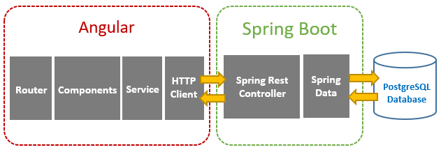
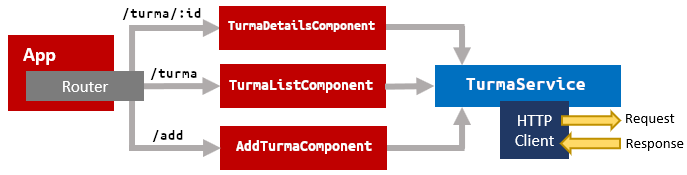
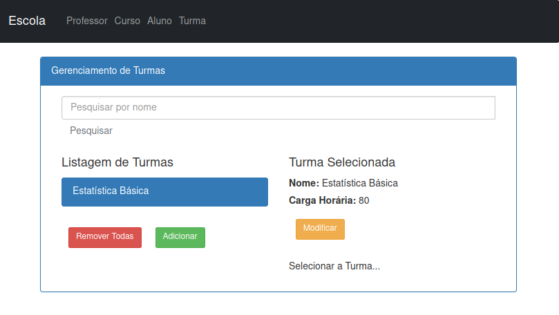
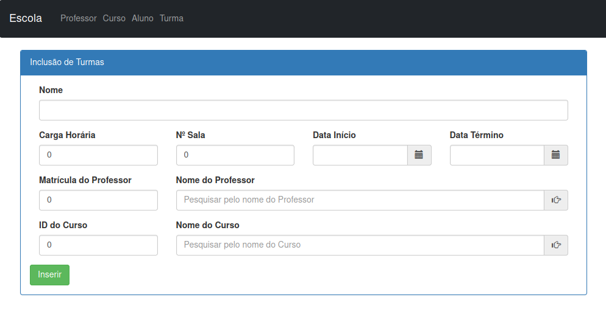
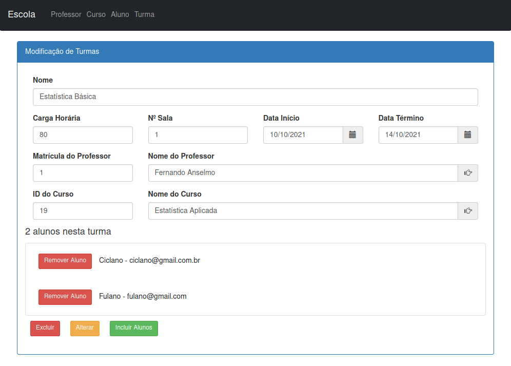

# Projeto Escola: Escola-Front
Este é um projeto que exemplifica como trabalhar com "Angular 11 + SpringBoot". A arquitetura deste foi montada conforme o seguinte esquema:



Ao ativar o Back acessar a documentação no Swagger:
http://localhost:8080/laboratorio/swagger-ui/index.html

Mais Detalhes do Back: https://github.com/fernandoans/escola-back

## Ferramentas Utilizadas
Para esta parte foram utilizadas as seguintes tecnologias:
* Angular 11
* Linguagem TypeScript
* Bootstrap 4.0

Para a parte do back-end (Escola-Back) foram utilizadas as seguintes tecnologias:
* Java - versão 8.0
* Spring Boot - versão 2.4.4
* SpringFox - versão 3.0.0
* Lombok - versão 1.18.20

# Para iniciar o Front

É necessário após a clonagem do projeto, executar a instalação para obter as bibliotecas necessárias:

```
$ npm install
$ npm start
```

Acessar o endereço http://localhost:4200

# Detalhes do FrontEnd

A estrutura de chamada dos componentes pode ser visualizada através do seguinte diagrama:



De modo a exemplificar, teremos as seguintes telas para uma chamada a turmas. Ao entrar na opção "Turma" a partir do menu principal, teremos a tela de "Gerenciamento da Turma":



Ao clicar no botão adicionar podemos cadastrar uma turma conforme a seguinte tela:



Na tela de "Gerenciamento da Turma" após selecionar uma turma da listagem é possível modificá-la e adicionar alunos a esta:



As outras telas seguem o mesmo padrão de cadastro.
